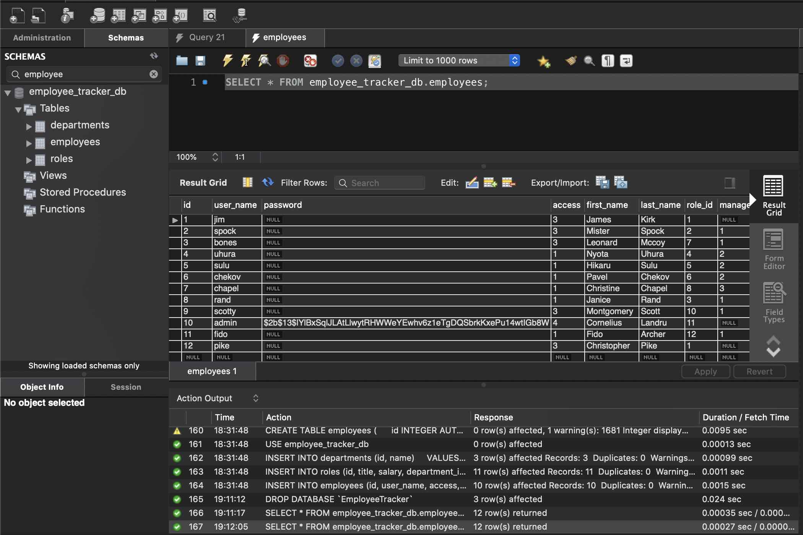
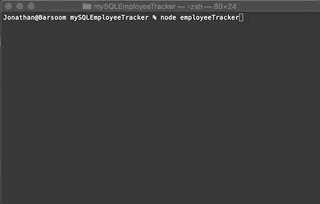
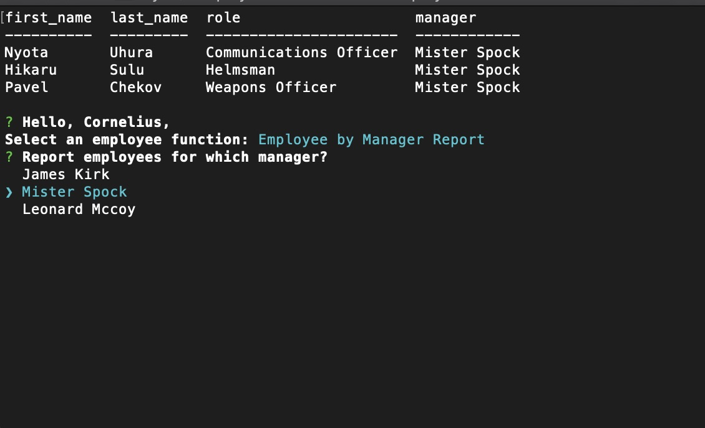
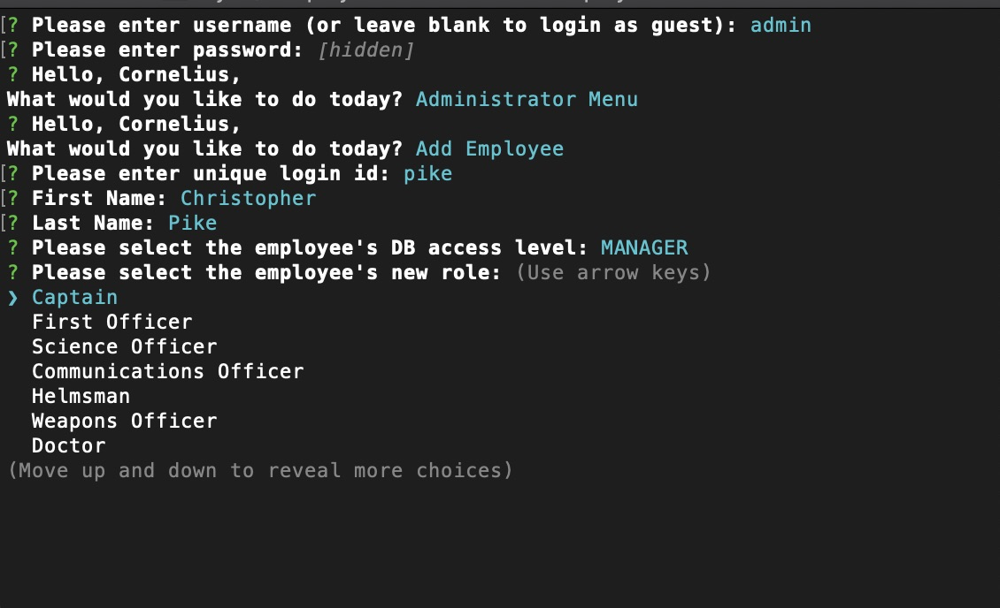

# mySQLEmployeeTracker - Employee Management System
[](https://opensource.org/licenses/MIT)

> Making administrative duties out of this world

The job was to use a command-line based node.js interface module to create an app that would interface with a MySQL database 
and provide standard functionality. It was a pretty good showcase for various SQL functions. I ran into some issues with inquirer 
about three-quarters of the way into the project, though, and my research suggested it might be a known bug. I decided to reinstall 
and start with fresh code to cover all my bases. That seemed to do the trick, and the app now seems to work as intended.

## Graphic


## User Story

```
AS A manager
I WANT an employee administration tool
SO THAT I can keep track of my workers
```

```
GIVEN THAT I open the tool in my console
WHEN I log into the system
THEN I want basic security measures that will protect my data
WHEN I have an employee use the system
THEN I want configurable access profiles based on responsibilities
WHEN I interface with the tool
THEN I want to see clean text menus with a coherent navigation flow
WHEN I read from the attached database
THEN I want the data formatted legibly on-screen
WHEN I make changes to the data
THEN I want those changes to persist
```

## Table of Contents
* [Technologies](#Technologies)
* [Getting Started](#Getting)
* [Usage](#Usage)
* [Questions](#Additional)
* [Contributing](#Contributing)
* [License](#License)
* [Content Advisory](#Content)

## Technologies
Node.js\
MySQL\
inquirer\
console.table\
bcrypt

## Getting Started
```
npm install
```
This module uses bcrypt for passwords, console.table to output table results to the terminal, inquirer for UI, and mysql for database access.

```
 DROP DATABASE IF EXISTS employee_tracker_db;
 CREATE DATABASE employee_tracker_db;
```
Don't forget to run the SQL script files schema.sql and seed.sql in MySQL workbench, in that order, to make and populate your tables before
you try to access them using the program. It has no table generation capabilities, so it won't run as expected (or, likely, at all) if the
tables aren't present and seeded.



## Usage

```
node employeeTracker.js
```



This app doesn't use command line parameters. It expects to find a copy of the employee_tracker_db accessible on PORT 3306 (MySQL).
The program has different permissions for different user access levels, so you'll need to log in as 'admin' to see all its features. 
None of the employees in the seed file have passwords specified, so the program will prompt you to enter and confirm a password 
the first time you log in. Be aware that passwords are stored and read from the DB as a bcrypt hash, so you can't edit password values 
directly except to delete them.
The program is strictly intended as an example of functionality, so the options you'll find in the different menus are bare bones. 
You can add a department, role, or employee through the Administrators menu. The Managers menu lets you update an employee's role. 
The Employees menu is basically a report menu in this demo, letting you print tables to the screen. 





## Additional Questions
Contact me by email or DM if you have any questions.

## Contributing
Contact us for guidelines on submitting contributions.

## License
This project is licensed under the The MIT License.

## Content Advisory
Star Trek and all its related characters and properties belong to [CBS Studios Inc](https://www.startrek.com).

  
### ionathas78

This file generated on 4/23/2020 by goodReadMeGenerator, copyright 2020 Jonathan Andrews
